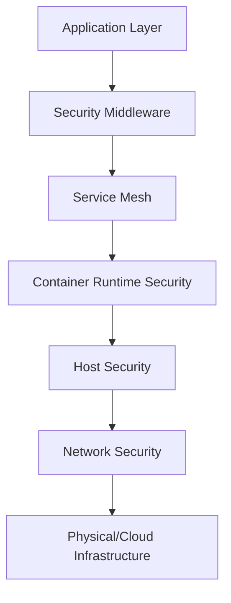

# AI Development Best Practices
*Security-First Design Patterns for Modern Development*

## Table of Contents
1. [Core Principles](#core-principles)
2. [Architecture Patterns](#architecture-patterns)
3. [Security-First Development](#security-first-development)
4. [Infrastructure as Code](#infrastructure-as-code)
5. [Automation Standards](#automation-standards)
6. [Tooling Guidelines](#tooling-guidelines)
7. [Monitoring and Observability](#monitoring-and-observability)
8. [Incident Response](#incident-response)

## Core Principles

### 1. Declarative Over Imperative
**Best Practice:** Everything is defined in code, making systems reproducible and auditable.

```yaml
# Good: Declarative approach
system_state:
  security_tools:
    - nmap: enabled
    - firewall: 
        state: active
        rules: from_file('firewall.rules')
  monitoring:
    - prometheus: enabled
    - grafana: enabled

# Avoid: Imperative approach
# install_nmap()
# configure_firewall()
# setup_monitoring()
```

### 2. Security by Default
**Best Practice:** Security tools and configurations are built-in, not bolted on.

- Every component must have security considerations documented
- Default configurations must be secure (fail closed, not open)
- Security scanning integrated into CI/CD pipeline
- Principle of least privilege enforced everywhere

### 3. Composability and Modularity
**Best Practice:** Separation of base system, tools, and user configurations.

```
project-structure/
├── core/               # Base system components
├── modules/           # Reusable, composable modules
├── configurations/    # Environment-specific configs
├── tools/            # Standalone tools and utilities
└── playbooks/        # Automated procedures
```

## Architecture Patterns

### 1. Layered Security Architecture
Following comprehensive security architecture patterns:



### 2. Port-Based Service Architecture
**Best Practice:** Consistent port allocation for services

```python
# service_ports.py
class ServicePorts:
    """Centralized port management for consistent service allocation"""
    
    # Core Services
    PROMETHEUS = 9090
    GRAFANA = 3000
    ALERTMANAGER = 9093
    
    # Security Services
    VAULT = 8200
    FALCO = 8765
    SURICATA_API = 8080
    
    # Application Services
    API_GATEWAY = 8000
    ADMIN_PANEL = 8010
    USER_PORTAL = 8020
    
    @classmethod
    def validate_port_availability(cls, port: int) -> bool:
        """Ensure port is not already allocated"""
        allocated_ports = [v for k, v in cls.__dict__.items() 
                          if isinstance(v, int)]
        return port not in allocated_ports
```

### 3. Event-Driven Security Response
```python
# security_events.py
from dataclasses import dataclass
from enum import Enum
from typing import Dict, Any

class SecurityEventType(Enum):
    AUTHENTICATION_FAILURE = "auth_failure"
    SUSPICIOUS_NETWORK = "suspicious_network"
    FILE_INTEGRITY = "file_integrity"
    PRIVILEGE_ESCALATION = "priv_escalation"

@dataclass
class SecurityEvent:
    event_type: SecurityEventType
    severity: str  # critical, high, medium, low
    source: str
    metadata: Dict[str, Any]
    
    def to_playbook(self) -> str:
        """Map event to appropriate response playbook"""
        playbook_mapping = {
            SecurityEventType.AUTHENTICATION_FAILURE: "auth_failure_response",
            SecurityEventType.SUSPICIOUS_NETWORK: "network_isolation",
            SecurityEventType.FILE_INTEGRITY: "file_integrity_response",
            SecurityEventType.PRIVILEGE_ESCALATION: "privilege_escalation_response"
        }
        return playbook_mapping.get(self.event_type, "generic_response")
```

## Security-First Development

### 1. Secure Coding Standards
```python
# secure_coding_example.py
import secrets
import hashlib
from typing import Optional
from functools import wraps
import time

class SecurityDecorators:
    @staticmethod
    def rate_limit(max_calls: int = 10, window: int = 60):
        """Rate limiting decorator for defensive security"""
        def decorator(func):
            calls = {}
            
            @wraps(func)
            def wrapper(request, *args, **kwargs):
                client_id = request.client_id
                current_time = time.time()
                
                if client_id not in calls:
                    calls[client_id] = []
                
                # Remove old calls outside window
                calls[client_id] = [call_time for call_time in calls[client_id] 
                                   if current_time - call_time < window]
                
                if len(calls[client_id]) >= max_calls:
                    raise Exception("Rate limit exceeded")
                
                calls[client_id].append(current_time)
                return func(request, *args, **kwargs)
            
            return wrapper
        return decorator
    
    @staticmethod
    def require_auth(permission: str):
        """Authentication decorator"""
        def decorator(func):
            @wraps(func)
            def wrapper(request, *args, **kwargs):
                if not request.user.has_permission(permission):
                    raise PermissionError(f"Permission {permission} required")
                return func(request, *args, **kwargs)
            return wrapper
        return decorator

# Usage example
@SecurityDecorators.rate_limit(max_calls=5, window=60)
@SecurityDecorators.require_auth("admin")
def sensitive_operation(request):
    """Protected operation with rate limiting and auth"""
    pass
```

### 2. Input Validation Framework
```python
# validation.py
from typing import Any, Dict, List
import re

class SecurityValidator:
    """Input validation with security-first approach"""
    
    @staticmethod
    def validate_input(data: Any, rules: Dict[str, List[str]]) -> Dict[str, Any]:
        """
        Validate input against security rules
        
        Rules format:
        {
            'field_name': ['required', 'alphanumeric', 'max:255'],
            'email': ['required', 'email'],
            'ip_address': ['required', 'ip']
        }
        """
        errors = {}
        validated = {}
        
        for field, field_rules in rules.items():
            value = data.get(field)
            
            for rule in field_rules:
                if rule == 'required' and not value:
                    errors[field] = f"{field} is required"
                    break
                    
                if rule == 'alphanumeric' and value:
                    if not re.match(r'^[a-zA-Z0-9]+$', str(value)):
                        errors[field] = f"{field} must be alphanumeric"
                        break
                        
                if rule == 'email' and value:
                    if not re.match(r'^[a-zA-Z0-9._%+-]+@[a-zA-Z0-9.-]+\.[a-zA-Z]{2,}$', value):
                        errors[field] = f"{field} must be a valid email"
                        break
                        
                if rule.startswith('max:') and value:
                    max_length = int(rule.split(':')[1])
                    if len(str(value)) > max_length:
                        errors[field] = f"{field} exceeds maximum length of {max_length}"
                        break
            
            if field not in errors and value is not None:
                validated[field] = value
        
        if errors:
            raise ValueError(f"Validation errors: {errors}")
            
        return validated
```

## Infrastructure as Code

### 1. Configuration Management
**Best Practice:** All configurations versioned and declarative

```yaml
# infrastructure/base.yaml
apiVersion: v1
kind: SecurityConfiguration
metadata:
  name: production-security
  version: 1.0.0
spec:
  firewall:
    enabled: true
    default_action: deny
    rules:
      - name: allow-ssh
        port: 22
        source: 10.0.0.0/8
        action: allow
      - name: allow-https
        port: 443
        source: 0.0.0.0/0
        action: allow
  
  monitoring:
    prometheus:
      retention: 30d
      scrape_interval: 15s
    alerts:
      - name: high-cpu
        threshold: 80
        duration: 5m
        severity: warning
  
  security_scanning:
    vulnerability_scan:
      schedule: "0 2 * * *"
      severity_threshold: medium
    compliance_check:
      framework: "cis"
      schedule: "0 4 * * 0"
```

### 2. Environment Abstraction
```python
# config/environments.py
from abc import ABC, abstractmethod
from typing import Dict, Any

class Environment(ABC):
    """Base environment configuration"""
    
    @abstractmethod
    def get_config(self) -> Dict[str, Any]:
        pass
    
    @abstractmethod
    def get_security_config(self) -> Dict[str, Any]:
        pass

class DevelopmentEnvironment(Environment):
    def get_config(self) -> Dict[str, Any]:
        return {
            "debug": True,
            "log_level": "DEBUG",
            "database": "sqlite:///dev.db",
            "cache": "memory"
        }
    
    def get_security_config(self) -> Dict[str, Any]:
        return {
            "firewall": "permissive",
            "ssl": "self-signed",
            "auth": "basic"
        }

class ProductionEnvironment(Environment):
    def get_config(self) -> Dict[str, Any]:
        return {
            "debug": False,
            "log_level": "WARNING",
            "database": "postgresql://prod-db:5432/app",
            "cache": "redis://prod-cache:6379"
        }
    
    def get_security_config(self) -> Dict[str, Any]:
        return {
            "firewall": "strict",
            "ssl": "letsencrypt",
            "auth": "oauth2",
            "waf": "enabled",
            "ids": "enabled",
            "encryption": "aes-256-gcm"
        }
```

## Automation Standards

### 1. One-Command Deployments
**Best Practice:** Complex operations simplified to single commands

```bash
#!/bin/bash
# deploy.sh - One-command deployment for complex operations

deploy_security_stack() {
    echo "Deploying comprehensive security stack..."
    
    # Pre-flight checks
    check_prerequisites || exit 1
    
    # Deploy in parallel where possible
    {
        deploy_monitoring &
        deploy_ids &
        deploy_waf &
        deploy_vault &
        wait
    }
    
    # Configure integrations
    configure_integrations
    
    # Validate deployment
    run_security_tests
    
    echo "Security stack deployed successfully!"
}

# Make complex operations simple
alias deploy-prod="deploy_security_stack --env production --verify"
alias deploy-test="deploy_security_stack --env test --skip-verify"
```

### 2. Automated Security Testing
```python
# security_testing.py
import asyncio
from typing import List, Dict
from dataclasses import dataclass

@dataclass
class SecurityTest:
    name: str
    test_type: str  # static, dynamic, compliance
    target: str
    expected_result: Any

class SecurityTestRunner:
    """Automated security testing with comprehensive validation"""
    
    def __init__(self):
        self.tests: List[SecurityTest] = []
        self.results: Dict[str, Any] = {}
    
    async def run_all_tests(self):
        """Run all security tests in parallel where possible"""
        static_tests = [t for t in self.tests if t.test_type == "static"]
        dynamic_tests = [t for t in self.tests if t.test_type == "dynamic"]
        compliance_tests = [t for t in self.tests if t.test_type == "compliance"]
        
        # Run test categories in parallel
        results = await asyncio.gather(
            self.run_test_batch(static_tests),
            self.run_test_batch(dynamic_tests),
            self.run_test_batch(compliance_tests),
            return_exceptions=True
        )
        
        return self.generate_report(results)
    
    async def run_test_batch(self, tests: List[SecurityTest]):
        """Run a batch of tests"""
        tasks = [self.run_single_test(test) for test in tests]
        return await asyncio.gather(*tasks)
    
    def generate_report(self, results):
        """Generate comprehensive security report"""
        return {
            "timestamp": datetime.now().isoformat(),
            "total_tests": len(self.tests),
            "passed": sum(1 for r in results if r.get("passed")),
            "failed": sum(1 for r in results if not r.get("passed")),
            "details": results,
            "risk_score": self.calculate_risk_score(results)
        }
```

## Tooling Guidelines

### 1. Tool Selection Criteria
Based on security-focused toolset criteria:

- **Security First**: Every tool must have security implications considered
- **Composability**: Tools should work well together
- **Automation**: Prefer tools that can be automated
- **Observability**: Tools must provide metrics and logs
- **Community**: Strong community and regular updates

### 2. Standard Tool Categories
```yaml
# tools/standard-stack.yaml
security_tools:
  scanning:
    - name: trivy
      purpose: Container vulnerability scanning
      automation: true
    - name: semgrep
      purpose: Static application security testing
      automation: true
  
  monitoring:
    - name: prometheus
      purpose: Metrics collection
      ports: [9090]
    - name: grafana
      purpose: Visualization
      ports: [3000]
  
  runtime_protection:
    - name: falco
      purpose: Runtime security monitoring
      automation: true
    - name: apparmor
      purpose: Application sandboxing
      automation: true

development_tools:
  code_quality:
    - name: black
      purpose: Python formatting
      automation: true
    - name: pylint
      purpose: Python linting
      automation: true
  
  security_linting:
    - name: bandit
      purpose: Python security linting
      automation: true
    - name: safety
      purpose: Dependency vulnerability checking
      automation: true
```

## Monitoring and Observability

### 1. Comprehensive Monitoring Stack
```python
# monitoring/setup.py
class MonitoringSetup:
    """Comprehensive monitoring stack setup"""
    
    def __init__(self):
        self.components = {
            "metrics": ["prometheus", "node-exporter", "cadvisor"],
            "logs": ["fluentd", "elasticsearch", "kibana"],
            "traces": ["jaeger", "zipkin"],
            "security": ["falco", "suricata", "osquery"]
        }
    
    def deploy_stack(self, environment: str):
        """Deploy complete monitoring stack"""
        config = self.load_environment_config(environment)
        
        # Deploy components in dependency order
        for component_type, components in self.components.items():
            for component in components:
                self.deploy_component(component, config)
        
        # Configure dashboards
        self.setup_dashboards()
        
        # Configure alerts
        self.setup_alerts()
        
        return self.validate_deployment()
```

### 2. Security Metrics Framework
```python
# metrics/security_metrics.py
from prometheus_client import Counter, Histogram, Gauge
import time

# Define security metrics
failed_auth_attempts = Counter(
    'security_failed_auth_total',
    'Total failed authentication attempts',
    ['service', 'source']
)

api_request_duration = Histogram(
    'security_api_request_duration_seconds',
    'API request duration with security checks',
    ['endpoint', 'method']
)

active_security_alerts = Gauge(
    'security_active_alerts',
    'Currently active security alerts',
    ['severity', 'category']
)

class SecurityMetrics:
    """Security metrics collection framework"""
    
    @staticmethod
    def track_auth_failure(service: str, source: str):
        failed_auth_attempts.labels(service=service, source=source).inc()
    
    @staticmethod
    def track_api_call(endpoint: str, method: str):
        def decorator(func):
            def wrapper(*args, **kwargs):
                start_time = time.time()
                try:
                    result = func(*args, **kwargs)
                    return result
                finally:
                    duration = time.time() - start_time
                    api_request_duration.labels(
                        endpoint=endpoint,
                        method=method
                    ).observe(duration)
            return wrapper
        return decorator
```

## Incident Response

### 1. Automated Response Framework
```python
# incident_response/framework.py
from enum import Enum
from typing import Dict, List, Callable
import asyncio

class IncidentSeverity(Enum):
    CRITICAL = 1
    HIGH = 2
    MEDIUM = 3
    LOW = 4

class IncidentResponse:
    """Automated incident response framework"""
    
    def __init__(self):
        self.playbooks: Dict[str, List[Callable]] = {}
        self.escalation_chain = []
    
    def register_playbook(self, incident_type: str, actions: List[Callable]):
        """Register automated response playbook"""
        self.playbooks[incident_type] = actions
    
    async def handle_incident(self, incident):
        """Handle security incident with automated response"""
        severity = self.assess_severity(incident)
        
        # Immediate actions for critical incidents
        if severity == IncidentSeverity.CRITICAL:
            await self.emergency_response(incident)
        
        # Execute playbook
        playbook = self.playbooks.get(incident.type, self.default_playbook)
        for action in playbook:
            try:
                await action(incident)
            except Exception as e:
                await self.escalate(incident, e)
        
        # Post-incident actions
        await self.document_incident(incident)
        await self.notify_stakeholders(incident, severity)
    
    async def emergency_response(self, incident):
        """Emergency response for critical incidents"""
        actions = [
            self.isolate_affected_systems(incident),
            self.preserve_evidence(incident),
            self.notify_security_team(incident),
            self.activate_dr_plan(incident)
        ]
        await asyncio.gather(*actions)
```

### 2. Response Playbook Templates
```yaml
# playbooks/authentication_failure.yaml
name: Authentication Failure Response
trigger: 
  event_type: auth_failure
  threshold: 5
  window: 60s

actions:
  - name: block_source_ip
    type: firewall
    duration: 3600
    
  - name: alert_security_team
    type: notification
    channels: ["slack", "pagerduty"]
    
  - name: collect_logs
    type: forensics
    sources: ["auth.log", "access.log"]
    duration: -1h
    
  - name: check_other_services
    type: investigation
    targets: ["ssh", "web", "api"]
    
  - name: update_threat_intel
    type: intelligence
    action: add_ioc
```

## Summary

These AI development best practices provide a comprehensive framework for building secure, scalable, and maintainable systems. The key takeaways are:

1. **Security must be built-in, not bolted on**
2. **Declarative configuration enables reproducibility**
3. **Automation reduces human error and increases efficiency**
4. **Modularity enables flexibility and maintainability**
5. **Comprehensive monitoring enables rapid response**
6. **Infrastructure as code ensures consistency**

By following these patterns, AI development teams can create systems that are both powerful and secure, implementing sophisticated security-first approaches.