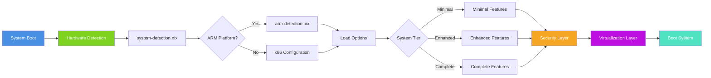
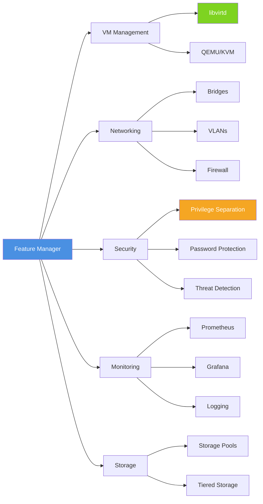
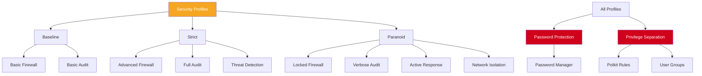
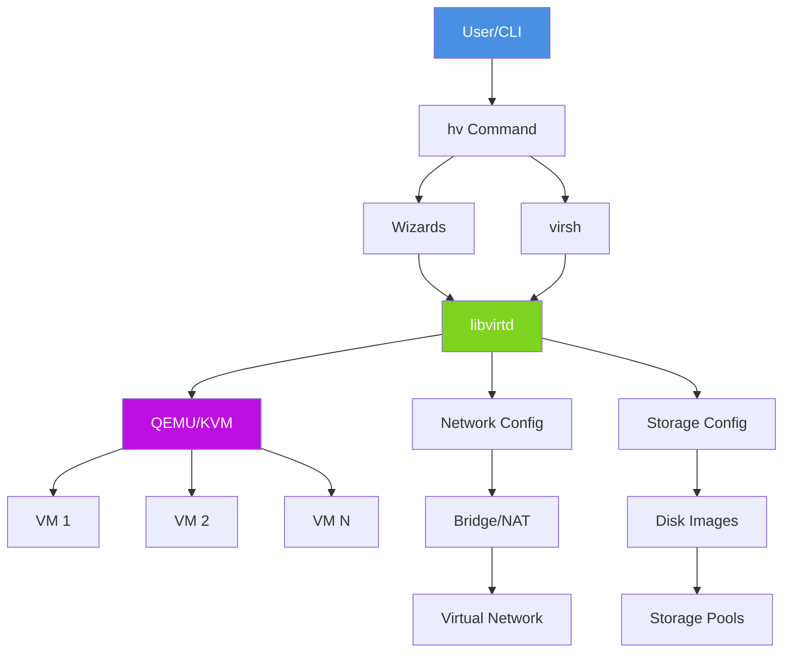
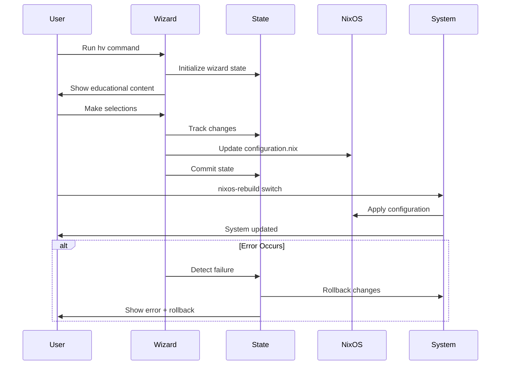
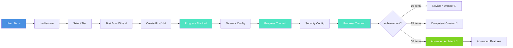
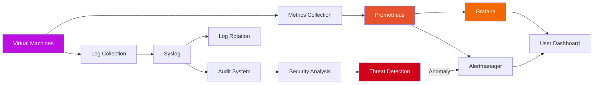
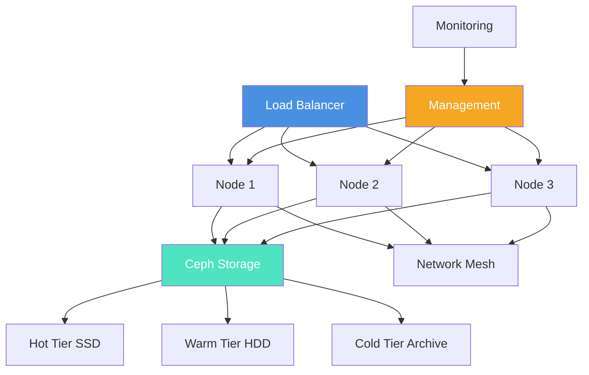

# Module Dependency Graph

Visual representation of Hyper-NixOS module dependencies and relationships.

## Core System Architecture

```mermaid
graph TD
    A[configuration.nix] --> B[Core Modules]
    A --> C[Security Modules]
    A --> D[Virtualization Modules]
    A --> E[Feature Modules]
    A --> F[GUI Modules]
    A --> G[Enterprise Modules]

    B --> B1[options.nix]
    B --> B2[packages.nix]
    B --> B3[system-detection.nix]
    B --> B4[arm-detection.nix]
    B --> B5[first-boot.nix]

    C --> C1[password-protection.nix]
    C --> C2[privilege-separation.nix]
    C --> C3[threat-detection.nix]
    C --> C4[profiles.nix]
    C --> C5[firewall.nix]
    C --> C6[polkit-rules.nix]

    D --> D1[libvirt.nix]
    D --> D2[performance.nix]
    D --> D3[networking.nix]
    D --> D4[gpu-passthrough.nix]

    E --> E1[feature-manager.nix]
    E --> E2[feature-categories.nix]
    E --> E3[progress-tracking.nix]

    style A fill:#4a90e2,color:#fff
    style B fill:#7ed321,color:#fff
    style C fill:#f5a623,color:#fff
    style D fill:#bd10e0,color:#fff
    style E fill:#50e3c2,color:#fff
```

## Module Import Flow

## Feature Dependencies

## Security Module Relationships

## Virtualization Stack

## Configuration Flow

## Educational Flow

## Data Flow

## Deployment Architecture (Enterprise)

## Notes

### Critical Paths

1. **Boot Flow**: hardware-configuration.nix → system-detection.nix → options.nix → feature-manager.nix
2. **Security**: password-protection.nix MUST load before any user configuration
3. **Virtualization**: libvirt.nix → performance.nix → networking.nix

### Circular Dependencies to Avoid

- ❌ Do NOT access `config.*` in module `let` bindings before `options` definition
- ❌ Do NOT create mutual imports between security modules
- ✅ Use `mkIf` for conditional configuration
- ✅ Define options before accessing config

### Best Practices

1. **Module Organization**: Group related functionality
2. **Dependency Order**: Core → Security → Features → Services
3. **Conditional Loading**: Use `mkIf` with clear conditions
4. **Documentation**: Comment complex dependencies

## See Also

- [PLATFORM-OVERVIEW.md](../dev/PLATFORM-OVERVIEW.md)
- [DESIGN-ETHOS.md](../dev/DESIGN-ETHOS.md)
- Individual module documentation in `/modules/*/README.md`
