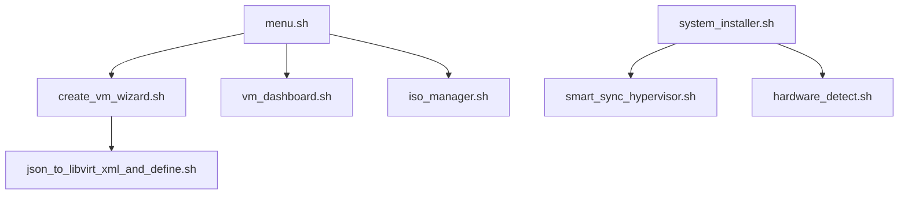

# Script Improvements Quick Reference Guide

## 🚀 Priority Improvements for Scripts and Automation

### Immediate Actions (Do Now)

#### 1. Add Missing Scripts to Documentation
**File:** `docs/reference/SCRIPT_REFERENCE.md`

Add documentation for:
- `alert_manager.sh` - Alert management system
- `audit_viewer.sh` - Security audit viewer
- `cloud_init_seed.sh` - Cloud-init configuration
- `detect_gui_environment.sh` - GUI detection
- `donate.sh` - Donation interface
- `guest_agent_actions.sh` - Guest agent operations
- `guided_backup_verification.sh` - Backup verification
- `guided_metrics_viewer.sh` - Metrics visualization
- `guided_system_test.sh` - System testing
- `interactive_tutorial.sh` - User tutorial
- `json_to_libvirt_xml_and_define.sh` - VM definition converter
- `per_vm_firewall.sh` - VM firewall management
- `per_vm_limits.sh` - VM resource limits
- `preflight_check.sh` - Pre-operation checks
- `resource_reporter.sh` - Resource reporting
- `rest_api_stub.sh` - REST API interface
- `template_clone_manager.sh` - Template management
- `toggle_boot_features.sh` - Boot feature management
- `toggle_gui.sh` - GUI toggle
- `vm_clone.sh` - VM cloning
- `vm_resource_optimizer.sh` - Resource optimization
- `vm_scheduler.sh` - VM scheduling
- `vm_templates.sh` - Template management

#### 2. Standardize Exit Codes
**Create:** `scripts/lib/exit_codes.sh`

```bash
#!/usr/bin/env bash
# Standard exit codes for all Hyper-NixOS scripts

readonly EXIT_SUCCESS=0
readonly EXIT_GENERAL_ERROR=1
readonly EXIT_MISSING_DEPENDENCY=2
readonly EXIT_PERMISSION_DENIED=3
readonly EXIT_INVALID_ARGUMENT=4
readonly EXIT_NETWORK_ERROR=5
readonly EXIT_CONFIG_ERROR=6
readonly EXIT_VM_ERROR=7
readonly EXIT_STORAGE_ERROR=8
readonly EXIT_TIMEOUT=9
readonly EXIT_USER_CANCEL=10
```

Then update scripts to:
```bash
source "${SCRIPT_DIR}/lib/exit_codes.sh"
# Use standardized codes
exit $EXIT_VM_ERROR
```

#### 3. Create Script Validation
**Create:** `scripts/validate_scripts.sh`

```bash
#!/usr/bin/env bash
set -euo pipefail

echo "=== Validating Hyper-NixOS Scripts ==="

# Check all scripts with ShellCheck
find scripts/ -name "*.sh" -type f | while read -r script; do
    echo -n "Checking $script... "
    if shellcheck "$script"; then
        echo "✓"
    else
        echo "✗"
        EXIT_CODE=1
    fi
done

# Verify common.sh usage
echo -e "\n=== Checking common.sh usage ==="
find scripts/ -name "*.sh" -type f | while read -r script; do
    if [[ "$script" == *"/lib/common.sh" ]]; then
        continue
    fi
    if ! grep -q "source.*common.sh" "$script"; then
        echo "⚠️  Not using common library: $script"
    fi
done

exit ${EXIT_CODE:-0}
```

### Short-term Improvements (This Week)

#### 1. Break Down Large Scripts
Focus on `menu.sh` first:

**Current structure:**
```
scripts/menu.sh (531 lines)
```

**New structure:**
```
scripts/menu/
├── menu.sh              # Main entry (50 lines)
├── lib/
│   ├── vm_menu.sh       # VM operations menu
│   ├── system_menu.sh   # System config menu
│   ├── admin_menu.sh    # Admin operations
│   └── ui_common.sh     # Shared UI functions
```

#### 2. Add Basic Tests
**Create:** `tests/unit/test_common.sh`

```bash
#!/usr/bin/env bash
source scripts/lib/common.sh

# Test validate_vm_name
echo "Testing validate_vm_name..."
assert_success() { [[ $? -eq 0 ]] || echo "FAIL: $1"; }
assert_failure() { [[ $? -ne 0 ]] || echo "FAIL: $1"; }

validate_vm_name "valid-vm-name" && assert_success "valid name"
validate_vm_name "../evil" || assert_failure "path traversal"
validate_vm_name "vm with spaces" || assert_failure "spaces"

echo "Tests complete!"
```

#### 3. Improve Error Messages
Update scripts to use consistent error formatting:

```bash
# Instead of:
echo "Error: Something failed"

# Use:
die "VM creation failed: Invalid disk size specified (got: $size, expected: >1G)"
```

### Medium-term Improvements (This Month)

#### 1. Create Script Dependency Map
**Create:** `scripts/DEPENDENCIES.md`

```markdown
# Script Dependencies

## Core Dependencies
- bash >= 4.0
- jq >= 1.6
- virsh (libvirt)
- whiptail or dialog
- curl
- git

## Script Call Graph

```

#### 2. Add Performance Monitoring
Create metrics collection for scripts:

```bash
# In common.sh, add:
script_timer_start() {
    SCRIPT_START_TIME=$(date +%s.%N)
}

script_timer_end() {
    local end_time=$(date +%s.%N)
    local duration=$(echo "$end_time - $SCRIPT_START_TIME" | bc)
    log_info "Script execution time: ${duration}s"
}

# Use in scripts:
script_timer_start
# ... script logic ...
script_timer_end
```

#### 3. Implement Parallel Operations
For bulk operations:

```bash
# Instead of:
for vm in $(list_vms); do
    check_vm_health "$vm"
done

# Use GNU parallel:
list_vms | parallel -j 4 check_vm_health {}
```

### Best Practices Checklist

#### For Every Script:
- [ ] Has copyright header and description
- [ ] Sources `lib/common.sh`
- [ ] Uses `set -Eeuo pipefail`
- [ ] Has proper error handling
- [ ] Uses standardized exit codes
- [ ] Validates all inputs
- [ ] Logs important operations
- [ ] Cleans up on exit
- [ ] Has usage/help function
- [ ] Documented in SCRIPT_REFERENCE.md

#### For New Features:
- [ ] Create focused, single-purpose scripts
- [ ] Use functions from common.sh
- [ ] Add unit tests
- [ ] Update documentation
- [ ] Consider automation needs
- [ ] Plan for monitoring

### Quick Wins

1. **Fix ShellCheck warnings** in existing scripts
2. **Add help text** to scripts missing it
3. **Standardize logging** format across all scripts
4. **Create templates** for new scripts
5. **Document undocumented** scripts

### Script Template

```bash
#!/usr/bin/env bash
#
# Script Name - Brief Description
# Copyright (C) 2024-2025 MasterofNull
# Licensed under GPL v3.0
#
# Purpose: What this script does
# Usage: How to use this script
#

# Source common library
SCRIPT_DIR="$(cd "$(dirname "${BASH_SOURCE[0]}")" && pwd)"
source "${SCRIPT_DIR}/lib/common.sh" || {
    echo "ERROR: Failed to load common library" >&2
    exit 1
}
source "${SCRIPT_DIR}/lib/exit_codes.sh"

# Initialize logging
init_logging "script_name"

# Script-specific configuration
readonly SCRIPT_VERSION="1.0.0"

# Functions
usage() {
    cat <<EOF
Usage: $(basename "$0") [OPTIONS] ARGUMENTS

Brief description of what this script does.

Options:
    -h, --help      Show this help message
    -v, --verbose   Enable verbose output
    
Arguments:
    ARGUMENT        Description of argument

Examples:
    $(basename "$0") example1
    $(basename "$0") --verbose example2

EOF
}

main() {
    # Main script logic here
    log_info "Script started"
    
    # Your code here
    
    log_info "Script completed successfully"
}

# Parse arguments
while [[ $# -gt 0 ]]; do
    case $1 in
        -h|--help)
            usage
            exit $EXIT_SUCCESS
            ;;
        -v|--verbose)
            DEBUG=true
            shift
            ;;
        *)
            # Handle other arguments
            shift
            ;;
    esac
done

# Run main function
main "$@"
```

## Remember

- **Small, focused improvements** are better than large rewrites
- **Test changes** before deploying
- **Document as you go**
- **Maintain backward compatibility**
- **Ask for help** when needed

This guide provides actionable steps to improve the scripting infrastructure while maintaining system stability.